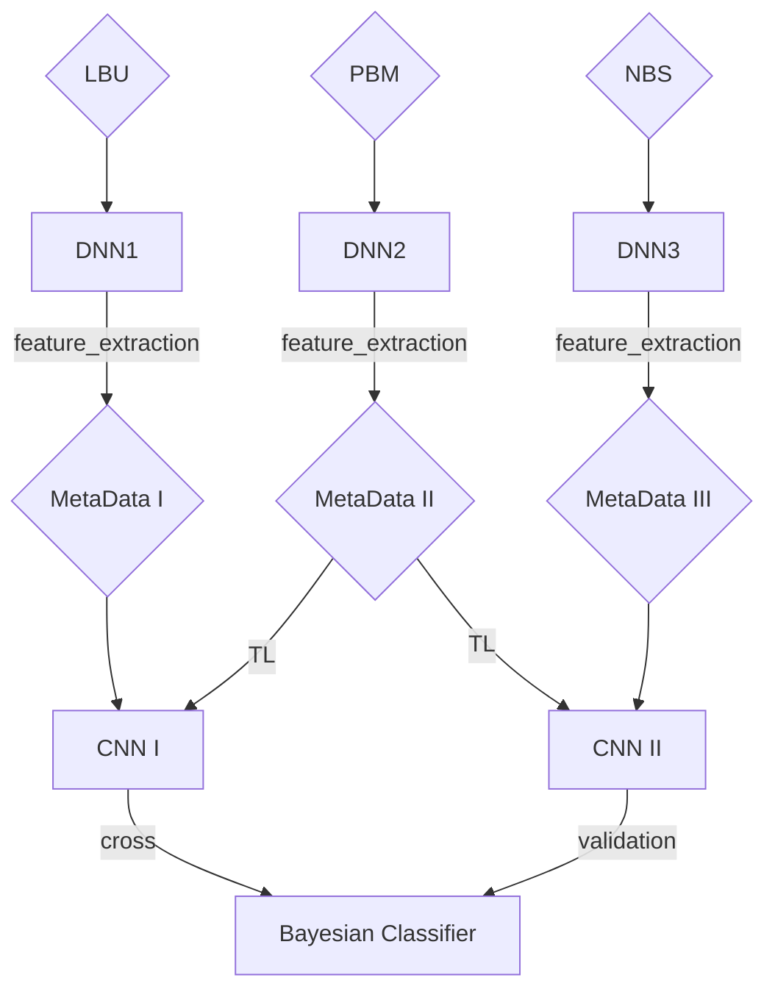

# DOS Attack classification with Deep Learning
Welcome everyone,

I'm most attached to this project since it's the one that introduce me to the world of Machine learning. 

We conduct analysis and classification of 7 different internet attack using [CICDDOS2019](https://www.unb.ca/cic/datasets/ddos-2019.html) datasets and [Dos 2017](https://www.unb.ca/cic/datasets/dos-dataset.html) datasets.

Dataset has 17 million records and special thanks to Lambda Machine Provided by [Beloit College](https://www.beloit.edu/) that enable the GPU accelarated Trainig possible.

## Data Overview:
| Datasets | Labels | Attributes|
| --| --| --|
|DDOS, DOS | ```Portmap``` , ```NetBIOS``` , ```LDAP``` , ```MSSQL``` , ```UDP``` , ```SYN``` , ```Benign``` |86 attributes|

Where Dos attacks need to conduct feature extraction through [CICFlowMeter](https://github.com/CanadianInstituteForCybersecurity/CICFlowMeter)

---

## Stage I: Baseline Training
CNN Results:
* ```DataSize:``` 17 million records from CIC DDOS 2019
* ```Attribute Used:``` 79 
* ```Model Structure``` : ```Conv1d```, ```Dropout```, ```Maxplooing```, ```Flatten```, ```Dense```*2
* ```Normalization:``` StandardScaler
* ```Optimizer:``` RMRprop
* ```Loss function:``` Sparse Categorical Crossentropy
* ```Acc:``` 96.57%
* ```Time:``` 142s
* ```Confusion Matrix:```
  
|Benign | LDAP | MSSQL | NetBIOS| Portmap | Syn| UDP|
| -- | --| --| --| --| --| --|
 |17354 |  0  |  0  |  49  |  9  |  89  |  03| 
   |  60 | 1767597  |  18600  |  296   | 0   | 125  |  1    |
   |  316  | 163203 | 5057501  | 263 |   0  |  117   |178796    |
   |  363  |  3  |  747| 3403276 |  0   | 81   | 7664    |
  |   334  |  0  |  746  |  172744| 2  |  201   | 401   |
 |  2319  |  0 |   4060  |  37  |  0 |3990594   | 641    |
  |  53  |  0 |  75080 |   228  |  0   | 40 |3427634  |


## Stage II: Transfer Learning
Transfer Learning Dos Models on DDos attack to compare accuracy with baseline models

[Here](final_results.xlsx) is a complete Result in excel regards different epoch and different freezing layers. you can download it and browse freely.

In this table we only show the first epoch and testing on 17 million records.
|Layer Freezed | Accuracy | Precision | Recall | Time |
| -----------  | ---------|-----------|--------| -----|
|No Freeze     | 94.72%   |  93.27%   | 94.72% | 140s |
|1 Freeze     | 97.13%   |  96.28%   | 96.68% | 140s |
|2 Freeze     | 97.34%   |  96.49%   | 96.89% | 142s |
|3 Freeze     | 95.06%   |  93.59%   | 94.31% | 141s |
|4 Freeze     | 97.21%   |  96.70%   | 97.21% | 140s |
|5 Freeze     | 97.38%   |  96.52%   | 97.38% | 139s |
| Mids Freeze     | 97.23%   |  96.37%   | 97.23% | 139s |
| Ends Freeze     | 97.52%   |  96.66%   | 97.53% | 141s |

## Stage III: Universal Meta Data Training Architecture - TL + FL
We mimic a situation where there are three organizations and each suffer from two different DDOS attacks, as shown in the table

Copmbined with a portion of Benign attack, we will have three edge of training data.

| Company | Attacks| Abbreviation|
|--|--|--|
|Organization I | LDAP, UDP| LBU|
|Organization II | Portmap, MSSQL| PBM|
Organization III | NetBIOS, SYN | NBS|


* Federated Learning: The results after Bayesian Classifier enable classification of all DDOS attacks without needed to share the first-hand data
* Transfer Learning: each CNN model will transfer learning with the other two edges for fine tuning.

---

## Roadmap
- [x] Implement Baseline experiment
- [x] Transfer Learning
- [ ] universal Metadata Training


## Contact
Ethan Wang - [e13wang@gmail.com](e13wang@gmail.com) - [Linkedin Profile](https://www.linkedin.com/in/ethan-wang-938588175/)

Project Link: [https://github.com/matsudatakeshi27/HeartDiseasePakula](https://github.com/EthanWTL/CyberSecurity)
